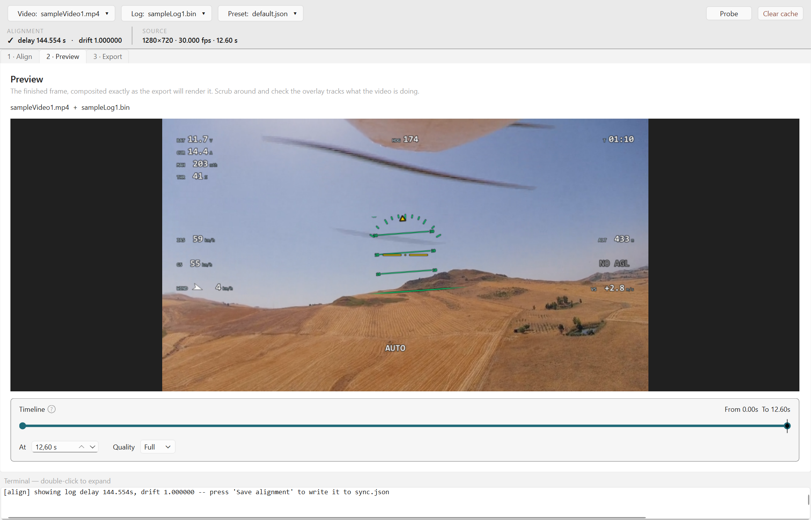
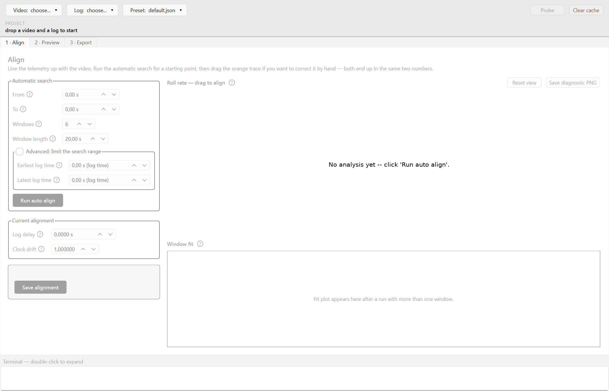
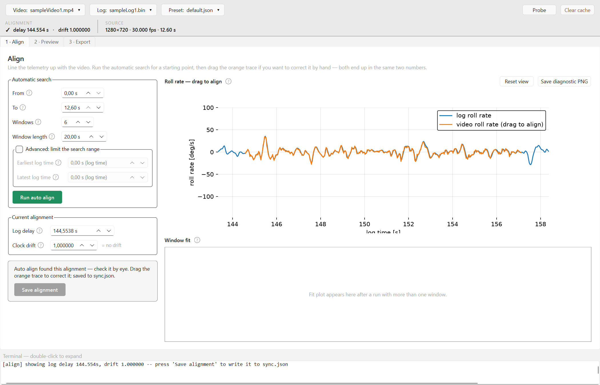
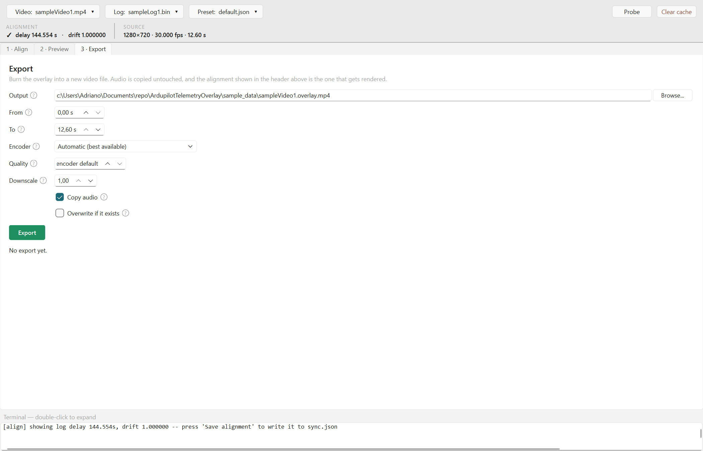

# ArduPilot Telemetry Overlay

Burns telemetry from an ArduPlane DataFlash log (`.bin`) onto flight video as an
FPV-style HUD/OSD: airspeed, ground speed, altitude, height above ground, vertical
speed, battery voltage/current/consumption, throttle, wind direction and speed,
autopilot status messages and an artificial horizon.

Video and log are aligned automatically: the program measures the **roll optical flow**
of the video — how fast the image itself rotates between consecutive frames — and
correlates it against the roll rate the autopilot recorded, so no clapperboard, no
matching timestamps and no manual counting are needed. It stays a suggestion you can
check and correct by hand, and the alignment can also be done entirely by eye when the
footage does not lend itself to the automatic search.



OS tested: Windows 11 and Ubuntu 22.04 LTS
Ardupilot logs tested: ArduPlane 4.7.0
Video files tested: RunCam Thumb Pro 4K

> **Note:** the `notes/` folder is a private git submodule (internal development
> notes, not needed to use or build the program). If you clone this repo without
> access to it, it will simply stay empty -- no impact on building, testing or
> running the app. See [`.gitmodules`](.gitmodules).

## Table of contents

- [Download and use prebuilt package](#download-and-use-prebuilt-package)
  - [1. Download and start the app](#1-download-and-start-the-app)
  - [2. Load a video and a log](#2-load-a-video-and-a-log)
  - [3. Align the telemetry with the video](#3-align-the-telemetry-with-the-video)
  - [4. Check the result in Preview](#4-check-the-result-in-preview)
  - [5. Export the finished video](#5-export-the-finished-video)
- [Working with source code](#working-with-source-code)
  - [Setup](#setup)
  - [Installation](#installation)
  - [Running the GUI from source](#running-the-gui-from-source)
- [Command line interface](#command-line-interface)
  - [How to run the commands](#how-to-run-the-commands)
  - [Shared options](#shared-options)
  - [`probe` — see what you have](#probe--see-what-you-have)
  - [`frame` — iterate on the look](#frame--iterate-on-the-look)
  - [`autosync` — suggest a log delay and clock-drift scale](#autosync--suggest-a-log-delay-and-clock-drift-scale)
  - [`manualsync` — check a chosen log delay by eye](#manualsync--check-a-chosen-log-delay-by-eye)
  - [`export` — write the final video](#export--write-the-final-video)
  - [Worked example: from `.bin` and `.mp4` to the finished video](#worked-example-from-bin-and-mp4-to-the-finished-video)
- [Other technical details](#other-technical-details)
  - [Synchronising video and telemetry](#synchronising-video-and-telemetry)
  - [Presets](#presets)
  - [Telemetry sources](#telemetry-sources)
  - [Cache](#cache)
  - [Re-encoding notes](#re-encoding-notes)
  - [Getting help from inside the app](#getting-help-from-inside-the-app)
  - [Startup splash](#startup-splash)
  - [Versioning and releases](#versioning-and-releases)
  - [Tests](#tests)

## Download and use prebuilt package

This is the easy way: no Python, no installation, nothing to configure. Download one
file, extract it, and follow the five steps below to turn a flight video and its
`.bin` log into a video with the telemetry burned in.

### 1. Download and start the app

Grab the package for your system from the [Releases page](../../releases):

- **Windows** — download `telemetry-overlay-gui-windows.zip`, extract it anywhere, and
  run `telemetry-overlay-gui.exe` inside the extracted folder.
- **macOS** — download `telemetry-overlay-gui-macos.dmg`, open it, and drag
  `TelemetryOverlay.app` into Applications. The app is not notarised by Apple, so the
  first launch will be blocked by Gatekeeper ("cannot be opened because the developer
  cannot be verified"): right-click the app, choose **Open**, and confirm once — this is
  only needed the first time.
- **Linux** — download `telemetry-overlay-gui-linux.tar.gz`, extract it, and run
  `./telemetry-overlay-gui` inside the extracted folder. Needs the system OpenGL/xkbcommon
  libraries Qt depends on (`libgl1`, `libegl1`, `libxkbcommon0`, `libxcb-cursor0` on
  Debian/Ubuntu — install with `apt-get install` if the app fails to start).

The package is self-contained: it bundles Python, FFmpeg and everything else. Keep it
somewhere you can write to — your Desktop or Documents folder is fine. If you put it
in a read-only location such as `Program Files`, the app says so at startup and asks
you to move it, because it needs to write its `cache/` folder next to itself.

Each package also ships a **`sample_data/` folder** — one short flight video
(`sampleVideo1.mp4`) and its matching log (`sampleLog1.bin`) — so you can walk through
the steps below right away, before hunting for your own footage. On Windows and Linux
it sits next to the executable; on macOS it sits next to `TelemetryOverlay.app` inside
the `.dmg`.

### 2. Load a video and a log

When it opens, the window is empty and asks for the two files:



**Drag the video and the `.bin` log anywhere onto the window** — both at once is fine.
(If you prefer, click the **Video** and **Log** buttons at the top and pick them from a
file dialog.) The log takes a few seconds to read the first time and is remembered
afterwards.

The strip along the top stays visible whatever you are doing: the three files in use,
a **Probe** button that prints everything the program can tell about them into the
panel at the bottom, a **Clear cache** button, and — on the second line — the current
alignment and the video's resolution, frame rate and duration.

The three numbered tabs below are simply the order of the work: **1 · Align**,
**2 · Preview**, **3 · Export**.

### 3. Align the telemetry with the video

The camera and the flight controller have no idea about each other, and the camera's
clock cannot be trusted, so the program has to be told which moment in the log matches
which moment in the video. That is the whole job of this tab, and it is the only step
that needs any judgement from you.



Press **Run auto align** and wait. The program measures the **roll optical flow** of the
video — it tracks features from one frame to the next and works out how fast the picture
itself is rotating — and slides that signal against the roll rate the autopilot recorded
until the two match. Nothing in the image needs to be readable or staged: the rolling
motion of the footage *is* the timing signal. The result is only ever a *suggestion*,
and it says so itself when it is not confident.

Check it on the big plot on the right. The blue trace is what the autopilot recorded,
the orange one is the roll measured from the video. **When they sit on top of each
other, the alignment is right** — that is exactly what the screenshot above shows. If
the orange trace is shifted sideways, **drag it left or right with the mouse** until the
two line up. Scroll to zoom in on the time axis, drag with the right button to stretch
the traces vertically, and **Reset view** puts the view back.

**Clock drift** is the second number, next to the log delay. Camera and autopilot clocks
run at very slightly different speeds, so a video that lines up perfectly at the start
can be out by a second or two several minutes later. The automatic search measures it
when the clip is long enough; the plain-language line next to the field
(`= +1.47 s every 1000 s`) tells you what the number actually means.

The empty **Window fit** panel underneath fills in only when the search used more than
one window: one dot per window, and the line through them is the clock drift. **Save
diagnostic PNG** writes a picture of the current alignment to disk if you want to keep
one.

If you have already analysed this clip once, the tab redoes the analysis by itself when
you open it — the result is cached, so it costs nothing and there is no button to press.

#### If the automatic search does not work

Optical flow needs textured ground in view and real rolling. Footage of empty sky,
straight and level cruise, or a gimbal-stabilised camera gives it nothing to correlate,
and it will honestly report `check it by eye` rather than invent a number. Very short
clips can also fail simply because they are shorter than one analysis window — try
setting **Window length** below the length of the clip and **Windows** to `1` (that is
what the sample video needs).

**You can do the whole alignment by hand, and it is not a fallback of last resort — it
is the same two numbers, reached a different way.** You are never obliged to accept what
the automatic search proposes:

- **By dragging the plot.** A search that ends in `check it by eye` still draws both
  traces — it measured the video's roll perfectly well, it just could not decide *which*
  of several similar manoeuvres to match it to. That is the case to drag: put the orange
  trace onto the blue one yourself until the peaks and dips coincide, and the Log delay
  field updates live as you drag, exactly as if you had typed it. (The plot needs one
  run to exist at all, since that run is what measures the video's roll; a low-confidence
  verdict costs you nothing here.)
- **By typing the numbers.** Type straight into **Log delay** (and **Clock drift** if
  you know it) and watch the plot and the Preview tab follow. The arrows step the value,
  which is the quickest way to close the last fraction of a second.
- **By eye, against the picture.** Pick one moment you can recognise in both — the
  takeoff rotation, a sharp roll, touchdown — and adjust the log delay until the
  Preview tab's artificial horizon does at that instant what the video shows the
  aircraft doing. Raising the log delay moves the overlay *earlier* in the video; see
  [Synchronising video and telemetry](#synchronising-video-and-telemetry) for the whole
  rule.

To get clock drift by hand, align at one point near the start and then check a point
several minutes later: if the second point has slipped, nudge Clock drift until both
ends hold.

#### Keeping the alignment

When the traces line up, press **Save alignment**. Until you do, the alignment exists
only for this session — the top of the window tells you which of the three states you
are in:

- `! not aligned yet — run Align`
- `● delay ... · drift ... — not saved` — you have an alignment, but closing the window
  would lose it
- `✓ delay ... · drift ...` — saved; next time you open this video it comes back by
  itself

### 4. Check the result in Preview


This is the finished frame, composited exactly the way the export will render it — so
what you see here is what you get. Drag the needle along the timeline to scrub through
the clip and check that the overlay follows what the aircraft is doing: the artificial
horizon is the giveaway, since a sharp roll shows up half a second of error
immediately, while speed and altitude change far too slowly to judge.

If something looks off, go back to **1 · Align** and drag the trace a little; the
preview follows immediately.

The two round handles on the timeline set a **From**/**To** range shared with the
other two tabs — use them if you only want to work on, or export, part of the clip.
Click the empty groove to jump the needle there. The **Quality** selector only affects
this on-screen preview, never the export; drop it to 1/2 or 1/4 if scrubbing feels
sluggish on a 4K clip.

### 5. Export the finished video



Set where the file should go (it defaults to `<your video>.overlay.mp4`, next to the
original) and press **Export**. Everything else can stay as it is: the program picks
the fastest encoder your machine actually has, keeps the original resolution, frame
rate and quality, and copies the sound untouched.

Progress, speed and an estimated time appear in the panel at the bottom, followed by a
summary line when it finishes.

Two fields worth knowing about:

- **Downscale** — set it to `0.5` or `0.25` for a quick low-resolution draft. Useful to
  check the whole clip in a fraction of the time before committing to the full-size
  export.
- **From**/**To** — the same range as the Preview timeline. Exporting ten seconds first
  is always a good idea.

Hover the small **?** next to any field for a description of what it does.

## Working with source code

### Setup

Building from source (for the CLI, or for development) needs Python **3.11 or newer**.
From the project root:

```bash
python -m venv .venv
.venv/Scripts/python.exe -m pip install -r requirements.txt   # Windows
.venv/bin/pip install -r requirements.txt                     # Linux / macOS
```

That pulls in everything, including `matplotlib` (used by the diagnostic plots of
`autosync` and `manualsync`) and `pytest`. No external FFmpeg installation is needed:
PyAV bundles a complete FFmpeg build, including the NVENC hardware encoders — `probe`
reports which of them this machine can actually use.

### Installation

There is no `telemetry-overlay` file in the project root: it is a console script that
only exists once the package is installed into the virtualenv. Install the package
once, in editable mode, and both commands become available inside the virtualenv:

```bash
.venv/Scripts/python.exe -m pip install -e .      # Windows
.venv/bin/pip install -e .                        # Linux / macOS
```

Running without installing is also possible — see
[How to run the commands](#how-to-run-the-commands).

### Running the GUI from source

```powershell
.venv\Scripts\telemetry-overlay-gui.exe                                    # empty, drag files in
.venv\Scripts\telemetry-overlay-gui.exe "sample_data\sampleVideo1.mp4" "sample_data\sampleLog1.bin"
```

```bash
# Linux / macOS, without installing
PYTHONPATH=src .venv/bin/python -m telemetry_overlay.gui.app \
    sample_data/sampleVideo1.mp4 sample_data/sampleLog1.bin
```

The video, log and preset paths are all optional positionals; anything omitted can be
dragged in afterwards. For what the three tabs do and how to use them, see
[Download and use prebuilt package](#download-and-use-prebuilt-package) above — the GUI
is identical whether it was installed from a release or started from source.

The GUI is a thin layer over the CLI: every action calls the same
`cmd_probe`/`cmd_autosync`/`export_video`/... code the CLI uses, prints the same text
into its terminal pane, and writes the same files, so the two never disagree. The one
exception is the Export tab, which builds `ExportOptions` and calls `export_video()`
directly instead of going through `cmd_export` — see the note on the
`--scale`/`--time-scale` collision under [`export`](#export--write-the-final-video).

## Command line interface

The command line exposes the same work as the GUI, plus the pieces that only make
sense in a script: rendering single frames while iterating on a preset, batching
exports, and inspecting a log without opening a window.

### How to run the commands

**Installed.** From the project root:

```powershell
.venv\Scripts\telemetry-overlay.exe probe "sample_data\sampleVideo1.mp4" "sample_data\sampleLog1.bin"
```

Activating the venv (`.venv\Scripts\Activate.ps1`, or `source .venv/bin/activate`) lets
you drop the path and type `telemetry-overlay` directly. Every example below writes
just `telemetry-overlay`; substitute whichever form you use.

**Without installing.** Run the package as a module, telling Python where the sources
are. From the project root:

```powershell
$env:PYTHONPATH = "src"
.venv\Scripts\python.exe -m telemetry_overlay probe "sample_data\sampleVideo1.mp4" "sample_data\sampleLog1.bin"
```

```bash
# Linux / macOS equivalent
PYTHONPATH=src .venv/bin/python -m telemetry_overlay probe \
    sample_data/sampleVideo1.mp4 sample_data/sampleLog1.bin
```

`$env:PYTHONPATH` lasts for the current shell session only, so set it once per terminal.
Note the quotes: paths containing spaces need them.

The five subcommands:

```bash
telemetry-overlay probe      flight.MP4 flight.bin    # what the two files contain
telemetry-overlay autosync   flight.MP4 flight.bin    # suggest the sync (never applied by itself)
telemetry-overlay manualsync flight.MP4 flight.bin --log-delay 171.8   # check a sync by eye
telemetry-overlay frame      flight.MP4 flight.bin --at 40 --log-delay 171.8   # iterate on the look
telemetry-overlay export     flight.MP4 flight.bin --from 210 --to 220         # write the video
```

Two global flags go **before** the subcommand name:

- `--version` — print the package version and exit.
- `-v`, `--verbose` — raise the logging level; repeatable (`-vv` for debug).

All five subcommands take the video as the first positional. `probe` takes the log as an
optional second positional; the other four require it.

### Shared options

`-p`, `--preset PATH` is accepted by `frame`, `autosync`, `manualsync` and `export`
(default: `presets/default.json`, see [Presets](#presets)). `autosync` and `manualsync`
accept it only for consistency — neither uses it.

The sync options below are accepted by `frame`, `manualsync` and `export`. `autosync`
does **not** take them: it computes the sync instead of receiving it.

- `--log-delay SECONDS` — the log time matching video time zero (advanced; the direct
  form, handy for nudging a number you already have).
- `--anchor-video-time SECONDS` / `--anchor-log-time SECONDS` — the alternative form,
  given as a pair: the video and the log timestamps of one moment you recognise in both
  (e.g. takeoff). The log delay is computed from the two. Mutually exclusive with
  `--log-delay`, and the two must be given together.
- `--time-scale FACTOR` — clock-drift scale in
  `log_time = log_delay + video_time * scale` (default `1.0`). Combines with either form
  above and needs one of them present. Not to be confused with `export`'s `--scale`,
  which downscales the output frame.

When none of them is given, `frame` and `export` fall back to the video's saved sync
(see [Cache](#cache)), and to `0` / `1.0` if there is no such file. `manualsync` has no
fallback: it requires `--log-delay` or the anchor pair.

`--save-sync` is accepted by `frame` and `export` only. It writes the log delay and
scale in effect — whether given on the command line or read back from an existing file —
to the **video**'s `sync.json` under `cache/` (see [Cache](#cache)), whatever the log is
called. If they came from the anchor pair, both timestamps are stored too, so the file
stays readable and re-editable.

### `probe` — see what you have

Reports the video's exact frame rate, duration and codec, which encoders this machine
can use, and — when a log is given — every telemetry channel found with its source,
rate, valid fraction and range, plus the flight modes, the arming time and the range of
log delays for which the clip fits inside the log.

```
telemetry-overlay probe <video> [log]
```

- `video` — path to the video file (required).
- `log` — path to the `.bin` DataFlash log (optional). Without it, only the video and
  the encoder list are reported.

```bash
telemetry-overlay probe flight.MP4 flight.bin
telemetry-overlay probe flight.MP4               # video and encoders only
```

An encoder marked `no` is simply unavailable here; on a machine without an NVIDIA GPU
only the software encoders show up, which is fine, just slower.

### `frame` — iterate on the look

Renders one composited frame to a PNG in about a second, and prints the log time, flight
mode, flight timer, every channel value and the messages on screen at that instant. This
is the fast loop for adjusting a preset or a log delay, with no export to wait for.

```
telemetry-overlay frame <video> <log> [-p PRESET]
    [--log-delay SECONDS | --anchor-video-time SECONDS --anchor-log-time SECONDS]
    [--time-scale FACTOR] [--save-sync]
    [--at SECONDS] [-o PATH] [--width PIXELS] [--overlay-only]
```

- `video`, `log` — required positionals.
- `--at SECONDS` — video time to render (default `0`).
- `-o`, `--output PATH` — where to write the PNG (default: `out/frame.png`).
- `--width PIXELS` — downscale the saved image to this width; full resolution by
  default. Handy for a quick look without waiting on a 4K PNG.
- `--overlay-only` — save the transparent HUD alone, as an alpha-channel PNG, instead of
  compositing it onto the video frame.
- plus the shared preset and sync options above.

```bash
telemetry-overlay frame flight.MP4 flight.bin --at 42 --log-delay 250 -o out/f.png
telemetry-overlay frame flight.MP4 flight.bin --at 42 --overlay-only   # HUD alone
telemetry-overlay frame flight.MP4 flight.bin --at 42 --width 960 -o out/preview.png
```

The horizon is the most sensitive thing to check the sync against: at a sharp roll, half
a second of error is obvious, while speed and altitude change far too slowly to judge.

### `autosync` — suggest a log delay and clock-drift scale

Measures how fast the image rotates (optical flow) and correlates it with the roll rate
in the log. It runs the optical flow once across the whole span, picks the windows where
the image actually rotates the most (calm cruise or straight legs cannot correlate
against anything, so there is no point spending a window on them), correlates each
against the log, and fits a log delay *and* a scale through the windows that agree with
each other — clocks drift, so a single offset that matches at one point in the video can
be seconds off at another. Prints the per-window table and a confidence verdict, and
changes nothing unless you pass `--write`.

```
telemetry-overlay autosync <video> <log> [-p PRESET]
    [--from SECONDS] [--to SECONDS] [--windows N] [--window-length SECONDS]
    [--search-min SECONDS] [--search-max SECONDS] [--write] [--plot DIR]
```

- `video`, `log` — required positionals.
- `--from SECONDS` — video time to start spreading windows from (default `0`).
- `--to SECONDS` — video time to stop spreading windows at (default: end of video).
- `--windows N` — number of analysis windows, picked from wherever the image rotates the
  most within `--from`/`--to`, spaced at least one window apart (default `6`). Each is
  scored independently, and only the ones that agree with each other — a distinct
  correlation peak, and a consistent log-delay-vs-time line — feed the fit; a window
  that is active but matched the wrong manoeuvre is excluded, not averaged in.
  `--windows 1` disables the scale fit, analyses `--from`→`--to` as one slice, and keeps
  `scale` at `1.0`.
- `--window-length SECONDS` — duration of each window (default `20`). Longer windows
  correlate more reliably but cost more decode time; long 4K footage needed `40` to get
  a confident peak per window.
- `--search-min` / `--search-max SECONDS` — bound the log delay the estimate may return,
  in **log** seconds — the same quantity `probe` reports as "valid log delays". Applied
  to every window.
- `--write` — store the accepted estimate (log delay **and** scale) in the video's
  `sync.json` (see [Cache](#cache)). Without it, `autosync` only prints the suggestion;
  nothing is ever written automatically.
- `--plot DIR` — save `autosync_diagnostics.png` (roll and roll-rate overlay for the
  *whole* analysed `--from`→`--to` span, from the single continuous optical-flow pass —
  not just the best-scoring window) and, with more than one window, `autosync_fit.png`
  (each window's log delay against its position in the video, trustworthy vs. discarded,
  and the fitted line, whose slope *is* the drift).
- `-p`, `--preset PATH` — accepted, unused.

Needs visible, textured ground and real manoeuvring. Footage of empty sky, straight and
level flight, or a gimballed camera will not correlate in any window; that is what the
per-window and overall confidence verdicts are for. Always verify with `frame` or
`manualsync` at more than one point in the video before trusting the result.

```bash
telemetry-overlay autosync flight.MP4 flight.bin --search-min 170 --search-max 420
telemetry-overlay autosync flight.MP4 flight.bin --search-min 170 --search-max 420 --write
```

On a 225 s 4K test flight, using the log window `probe` reported (`171.7` → `415.9`) and
40 s windows because the default 20 s were too short for a confident peak on that
footage, it found `log_delay 414.057s`, `scale 1.00137` from 3 windows (correlation up
to `0.98`) spanning 168 s — consistent with the manually-found `414.130` around video
time 100 s, and with the drift that made a fixed offset lose sync by video time 200 s.

Not every clip correlates this cleanly. On footage with a less distinctive roll signal
(similar turns repeated throughout, or long calm stretches) the windows may not agree
closely enough to pass the fit's checks, even after several tries with different
`--window-length`/`--windows` values — `autosync` then says `check it by eye` rather than
guess. That is the design, not a bug: fall back to anchoring by eye at more than one
point in the video.

### `manualsync` — check a chosen log delay by eye

Plots one video slice's optical-flow roll rate against the log's roll and roll rate,
shifted by a sync you already picked (by hand, or from `autosync`). Unlike `autosync` it
searches for nothing; it just draws the two-panel diagnostic for that slice so you can
see whether the traces line up.

```
telemetry-overlay manualsync <video> <log> [-p PRESET]
    [--from SECONDS] [--to SECONDS]
    (--log-delay SECONDS | --anchor-video-time SECONDS --anchor-log-time SECONDS)
    [--time-scale FACTOR] [--plot DIR]
```

- `video`, `log` — required positionals.
- `--from` / `--to SECONDS` — the video slice to analyse, in video seconds (default: the
  whole video, `0` to its end).
- `--plot DIR` — directory to save `manualsync_diagnostics.png` in (default: `out`).
- plus the shared preset and sync options above — with the sync **required** here: there
  is no saved-sync fallback, and no `--save-sync`.

```bash
telemetry-overlay manualsync flight.MP4 flight.bin --from 60 --to 90 --log-delay 206.1
```

### `export` — write the final video

Decodes, composites the HUD and encodes, copying the audio packet by packet. Prints
throughput and ETA while it runs, and the encoder, band coverage and file size at the
end.

```
telemetry-overlay export <video> <log> [-p PRESET]
    [--log-delay SECONDS | --anchor-video-time SECONDS --anchor-log-time SECONDS]
    [--time-scale FACTOR] [--save-sync]
    [-o PATH] [--from SECONDS] [--to SECONDS]
    [--encoder KEY] [--quality N] [--scale FACTOR] [--no-audio] [-y]
```

- `video`, `log` — required positionals.
- `-o`, `--output PATH` — where to write the file (default: `<video stem>.overlay.mp4`,
  next to the source video).
- `--from SECONDS` — trim start, in video seconds (default: from the beginning).
- `--to SECONDS` — trim end, in video seconds (default: to the end of the video).
- `--encoder KEY` — one of `nvenc_h264`, `nvenc_hevc`, `x264`, `x265`; see `probe` for
  which of these this machine actually supports. Default: the best available, NVENC
  first, falling back to x264.
- `--quality N` — CQ (NVENC) or CRF (x264/x265) value; lower is higher quality and a
  larger file. Default depends on the chosen encoder. The output bitrate is also capped
  near the source video's own bitrate (when the source reports one), so raising quality
  past what the source needs stops paying for it in file size once the cap is hit.
- `--scale FACTOR` — downscale the output by this factor (e.g. `0.5` for half
  resolution) for a fast draft export while iterating on a preset or a sync. The HUD is
  unaffected: element geometry is frame-relative, so it renders correctly at any size.
  Default: `1.0`, the source resolution.
- `--no-audio` — drop the audio track instead of copying it untouched.
- `-y`, `--overwrite` — overwrite `--output` if it already exists; otherwise `export`
  refuses to clobber an existing file.
- plus the shared preset and sync options above.

```bash
# 10-second test segment first: seconds instead of minutes, and half resolution for speed
telemetry-overlay export flight.MP4 flight.bin --log-delay 250 --from 100 --to 110 \
    --scale 0.5

# then the whole clip at full resolution, with an explicit encoder and quality
telemetry-overlay export flight.MP4 flight.bin --log-delay 250 \
    --encoder x264 --quality 20 -o flight_hud.mp4 -y
```

Expect roughly 9 fps at 4K with the software encoder — about 12 minutes for a 4-minute
clip — and far less with NVENC. Always render a short segment before committing to the
whole flight.

> **Known issue.** In `export`, `--scale` (frame downscale) and `--time-scale`
> (clock drift) both land on `args.scale`, because `--time-scale` is declared with
> `dest="scale"` and `--scale` gets the same attribute by default. In practice it is
> almost invisible, since the sync scale always stays close to `1.0`, but do not rely
> on passing both in the same invocation. The GUI's Export tab sidesteps it entirely by
> calling `export_video()` directly.

### Worked example: from `.bin` and `.mp4` to the finished video

Using the clip shipped in `sample_data/` — a 12.6 s, 1280x720 flight with its log. Run
these from the project root.

**1. See what you have.** Always start here: it confirms the two files can be read,
and prints the range of log delays for which the clip fits inside the log — a sanity
check on any alignment you find later.

```bash
telemetry-overlay probe sample_data/sampleVideo1.mp4 sample_data/sampleLog1.bin
```

```
video: sampleVideo1.mp4
  resolution   1280x720  rotation 0°
  frame rate   30 (30.000 fps, exact fraction)
  frames       378  duration 12.600s (00:12)
  codec        h264 / yuvj420p
  audio        aac @ 48000 Hz (copyable)
...
log: sampleLog1.bin
  window       87.0s -> 180.0s (93.0s of flight controller time)
  armed at     87.0s
  video length 12.6s
  the clip fits inside the log: valid log delays run from 87.0 to 167.4
```

**2. Find the alignment.** The clip is shorter than one default 20 s analysis window,
so analyse it as a single window:

```bash
telemetry-overlay autosync sample_data/sampleVideo1.mp4 sample_data/sampleLog1.bin \
    --windows 1
```

```
analysing 1 window(s) of 20s spread over 0s -> 13s of video (optical flow vs logged roll rate)...
  tracking [############################] 100.0%
  estimated log delay: 144.554 s
  estimated scale    : 1.00000
  verdict            : looks trustworthy
```

`144.554` sits inside the `87.0 .. 167.4` range `probe` reported, which is the first
thing to check. With the default `--windows 6` on a clip this short, most windows
overlap and only one comes out trustworthy: `autosync` then says `check it by eye`
instead of fitting a drift it cannot support. On a longer flight, leave the default and
let it estimate the drift too.

**3. Check it before spending time on an export.** Render one frame at a moment with
some roll in it and look at the artificial horizon:

```bash
telemetry-overlay frame sample_data/sampleVideo1.mp4 sample_data/sampleLog1.bin \
    --at 5 --log-delay 144.554 -o out/check.png
```

If the horizon disagrees with the picture, nudge `--log-delay` and re-render (see
[Synchronising video and telemetry](#synchronising-video-and-telemetry) for which way to
move it), or plot the whole clip's roll rate against the log's with `manualsync`:

```bash
telemetry-overlay manualsync sample_data/sampleVideo1.mp4 sample_data/sampleLog1.bin \
    --log-delay 144.554 --plot out
```

**4. Save the alignment** so later commands pick it up without being told:

```bash
telemetry-overlay frame sample_data/sampleVideo1.mp4 sample_data/sampleLog1.bin \
    --at 5 --log-delay 144.554 --save-sync
```

**5. Export.** With the sync saved, no sync flags are needed:

```bash
telemetry-overlay export sample_data/sampleVideo1.mp4 sample_data/sampleLog1.bin \
    -o out/sample_hud.mp4 -y
```

```
sampleVideo1.mp4 + sampleLog1.bin -> out\sample_hud.mp4
  log delay +144.554s   preset default.json
  378/378 [############################] 100.0% 102.5 fps  eta 00:00
done: 378 frames in 3.7s (102.5 fps) with h264_nvenc
  audio copied without re-encoding   overlay bands covered 31.5% of each frame
  wrote out\sample_hud.mp4 (4.5 MB)
```

On a full-length 4K flight, add `--from`/`--to` and `--scale 0.5` for a draft pass
before running the whole thing.

## Other technical details

### Synchronising video and telemetry

The camera clock cannot be trusted — on real footage the MP4 creation time can be off by
more than a year — so the alignment is explicit:

```
log_time = log_delay + video_time * scale
```

The **log delay** is the log time corresponding to video time zero. The **scale**
corrects clock drift between camera and flight controller; it defaults to `1.0` and stays
close to it, but over a few minutes the difference is enough to lose sync by the end even
when the start lines up perfectly.

**Raising the log delay moves the overlay earlier in the video, not later.** A higher log
delay matches video time zero against a log time further into the flight, so every log
event appears sooner on screen. In practice: overlay ahead of the picture (already
climbing while the aircraft is still on the ground) → lower the log delay; overlay
lagging the picture → raise it.

To find the log delay, pick one event you can see in the video *and* find in the log —
takeoff rotation, a sharp roll, touchdown — and pass both timestamps to
`--anchor-video-time`/`--anchor-log-time`; no mental subtraction needed. `probe` prints
the range of log delays for which the clip fits inside the log, as a sanity check. Then
refine by rendering frames with `frame` and nudging `--log-delay` in shrinking steps
(±5 s, ±1 s, ±0.2 s), checking against a sharp roll.

Scale needs two points far apart in the video: a single anchor cannot tell drift from a
plain offset. If a log delay matched by eye at one point is off at another several
minutes away, that difference is the drift. `autosync` fits both quantities at once
across several windows; alternatively set `--time-scale` by hand and verify at the far
point.

Save the result with `--save-sync` (writes the video's `sync.json` under `cache/`,
keeping the anchor pair alongside the log delay if that is what you used). Later commands
pick it up automatically whenever `--log-delay`, `--anchor-*` and `--time-scale` are all
omitted.

The sync file lives apart from the preset on purpose: a preset describes a *look* and is
reused across flights, while a log delay belongs to one video/log pair.

### Presets

`presets/default.json` holds the layout, the theme and the units. Positions are
normalised to the frame (0..1) and all sizes are fractions of frame height, so a preset
made against a 1080p proxy renders identically on a 4K master.

Element types: `readout` (any telemetry channel), `heading`, `mode`, `timer`, `horizon`,
`wind`, `messages`. Each entry takes `x`, `y`, `anchor`, `visible`, `scale`, `unit`,
`decimals` and a type-specific `options` block — see the docstrings in
`src/telemetry_overlay/hud/elements/`.

Units are per element: `km/h`, `kt`, `mph`, `m/s` for speeds, `m`/`ft` for heights,
`m/s_v`/`ft/min` for vertical speed, `A` for current, `mAh` for consumed charge, `%` for
throttle.

Two options worth knowing:

- `warn_below` / `warn_above` on a readout switch it to the theme's warning colour.
  Thresholds are in SI units (V, m, m/s) whatever the display unit.
- `pitch_offset` / `roll_offset` on the horizon are camera mount trim, in degrees, to
  line the artificial horizon up with the real one when the camera does not point along
  the flight path.

### Telemetry sources

Verified against ArduPlane 4.7. `probe` shows which source each channel actually used.

| Channel | Source | Fallback |
|---|---|---|
| IAS | `ARSP.Airspeed`, gated on the health flag | `CTUN.As` |
| GS | `hypot(XKF1.VN, XKF1.VE)` — EKF velocity, far smoother than GPS | `GPS.Spd` |
| ALT | `BARO.AltAMSL` (absolute) | `GPS.Alt`, `POS.Alt` |
| AGL | `RFND.Dist`, only while the rangefinder reports Good | none, by design |
| VS | `BARO.CRt` | `-XKF1.VD` |
| Voltage | `BAT.Volt` | — |
| Current | `BAT.Curr` | — |
| Consumed | `BAT.CurrTot` (already mAh, cumulative) | — |
| Throttle | `CTUN.ThO` (already 0..100 %) | — |
| Attitude | `ATT.Roll/Pitch/Yaw` | `AHR2` |
| Wind speed/direction | `XKF2.VWN/VWE` — EKF3 wind estimate | none, by design |
| Mode, messages | `MODE`, `MSG` | — |

**AGL shows `NO AGL` most of the time, and that is correct.** A rangefinder is a
short-range sensor — around 12 m on the test aircraft — so it only reads near the
ground, during takeoff, landing and low passes. There is deliberately no fallback to
barometric or terrain height: AGL here means a measured height. A hysteresis filter
(default 0.3 s) keeps the readout from strobing at the edge of the sensor's range.

**The wind arrow is nose-relative, not north-up.** It points where the wind is
blowing *toward*, relative to the aircraft's heading (straight up = dead ahead) — the
same convention as a G1000's wind vector, and the only one readable on a frame that is
always nose-forward rather than compass-oriented. There is no fallback for wind: a log
without an EKF3 wind estimate shows "no data" rather than guessing.

Status messages are guaranteed at least one second on screen each. When several arrive
in the same millisecond they queue rather than flash by. The boot banner and everything
logged before arming is hidden by default.

### Cache

Everything the program computes from a video or a log goes under a `cache/` folder, one
directory per source file (named after the file plus a hash of its full path, so two
clips with the same name never collide). That folder lives next to the running program:
in the repo root when running from source, next to the `.exe`/binary when running a
downloaded package.

| File | What it is |
|---|---|
| `telemetry.npz` | the parsed `.bin`, so only the first read costs anything |
| `roll-rate.npz` | the optical-flow roll rate, the slowest thing here (see below) |
| `plots/` | diagnostic PNGs the GUI regenerates on every run |
| `sync.json` | **not cache** — your log delay, see below |

All of it is derived and safe to delete; it is rebuilt on demand. Set
`TELEMETRY_OVERLAY_CACHE` to put the directory somewhere other than its default location.

**The optical-flow cache fills in as you go.** Its value for a given pair of consecutive
frames does not depend on the time range you asked for — a range only decides *which*
pairs get computed. So rather than caching "the analysis of 90–130s", it keeps one array
covering the whole video plus a record of which entries are real, and every request fills
only the holes inside it. Analysing 100–115s with `manualsync` and then the whole clip
with `autosync` computes 100–115s once, not twice; the same range twice is free;
overlapping or disjoint ranges in any order never recompute a pair. Measured on 4K test
footage: re-running the same 15s slice went from 18.8s to 0.02s, and widening a cached
100–115s slice to 90–130s cost 33% less than computing it from scratch — with a
bit-identical result.

**`sync.json` lives there but is not cache.** It holds the alignment you set by hand,
which nothing can recompute, so the GUI's **Clear cache** button and `clear_cache_for()`
both leave it alone. Alongside the log delay it records two timestamps: `created`, when
the alignment was first established (kept across later saves), and `updated`, rewritten
every time the file is saved — the one to check when asking whether a sync is still the
one you were working on. Files written by older versions, next to the video as
`<video>.sync.json`, are still read if the new location is empty; the next save moves
them.

### Re-encoding notes

Burning pixels into a picture requires decoding, compositing and encoding the video
stream: there is no way to avoid re-encoding it. What this tool does instead is keep the
loss negligible and the process fast:

- constant-quality encoding (NVENC CQ or x264 CRF) at the original resolution and exact
  frame rate, preserving the source's colour range and matrix, with the bitrate also
  capped near the source's own so re-encoding does not inflate the file size;
- the **audio stream is copied packet by packet**, never re-encoded;
- Python never touches the video's pixels. It draws only the HUD, into the handful of
  rectangular *bands* the layout can reach (typically a quarter of the frame area);
  decoding, compositing and encoding all happen in FFmpeg's C code inside the same
  process, with no frame pipe between processes.

If you want the original file left untouched, the alternative is to composite in a video
editor. Exporting the HUD alone to a file with an alpha channel is not implemented yet;
`frame --overlay-only` produces single transparent PNGs today.

### Getting help from inside the app

The header bar's bottom-right corner carries `v0.1.0 · by A. Arcadipane · Help`. **Help**
opens this README in your browser.

It tries to open the README *of the build you are running* —
`blob/v<version>/README.md` — so an older package does not describe a GUI you do not
have. Whether that tag exists is checked once at startup, on a background thread: if the
tag is missing (a source checkout, an unreleased version) or the machine is offline, the
link stays on the current README of the default branch. It is always clickable; the tag
lookup can only make it more specific, never break it.

### Startup splash

The packaged app shows a splash screen while it loads. It is worth knowing why the
wait exists: the **first** launch after extracting the package takes far longer than
later ones — measured on Windows, about 17 s against about 1 s once warm — because the
operating system has none of the bundle's ~390 MB of libraries cached yet, and the
antivirus reads all of them on the way through. Nothing is wrong; the second launch is
fast.

The splash is drawn by PyInstaller's bootloader, before Python itself starts, so it
covers the whole wait. **macOS is the exception**: PyInstaller does not support the
splash there, and the bouncing Dock icon is the startup feedback the system provides.

The artwork is a static PNG, `src/telemetry_overlay/gui/assets/splash.png`, generated
by `scripts/generate_splash.py` rather than drawn by hand — it reuses the app icon's
own artwork, so the two cannot drift apart. Nothing is rendered at startup: what the
file looks like is exactly what the user sees, so opening the PNG in any image viewer
is enough to preview a change. The version is painted into it, which means it has to be
re-rendered on every release — see [Versioning and releases](#versioning-and-releases).

### Versioning and releases

The version is written in exactly one place, `src/telemetry_overlay/__init__.py`:

```python
__version__ = "0.1.0"
```

Everything else reads it from there. `pyproject.toml` declares `dynamic = ["version"]`
and pulls it in through `[tool.setuptools.dynamic]`, so the installed package carries
the same number; `telemetry-overlay --version` prints it; and the GUI shows it in the
window title, at the right of the header bar and as the first line in its terminal
pane, so a user reporting a problem can quote the exact build they are running.

The GitHub tag is the one number nothing derives automatically, so the release workflow
checks it instead: on a `v*` tag, `.github/workflows/build.yml` compares the tag (minus
the leading `v`) against `__version__` and fails the build if they differ, before
anything is compiled or uploaded. A release whose executable reports a different version
than its tag therefore cannot be published.

#### The splash screen is the one copy that is a picture

The [startup splash](#startup-splash) has the version *painted into the image*, so it
cannot read `__version__` at runtime the way everything else does: it has to be
re-rendered whenever the version changes, with

```bash
python scripts/generate_splash.py
```

which rewrites `src/telemetry_overlay/gui/assets/splash.png` (commit it along with the
version bump). It is deliberately not regenerated during the packaged build: rendering
depends on the fonts installed on the machine doing it, and the CI runners for the three
operating systems do not have the same ones, so an automatic re-render would quietly
change the design depending on where the build ran.

Forgetting is caught rather than trusted. The generator also records the version it
baked in the PNG's text metadata, and the release workflow reads that back and fails a
`v*` build whose splash does not match `__version__`, telling you to re-run the script.
So a stale splash can cost you a failed build, never a wrong number in front of a user.

#### Cutting a release

```bash
# 1. bump __version__ in src/telemetry_overlay/__init__.py
vim src/telemetry_overlay/__init__.py

# 2. re-render the splash so its painted version matches
python scripts/generate_splash.py

# 3. commit both, tag with exactly the same number, push
git commit -am "release 0.2.0"
git tag v0.2.0
git push origin main --tags
```

The tag triggers the build for Windows, macOS and Linux and attaches the three archives
to the GitHub Release. Both checks — tag against `__version__`, and splash against
`__version__` — run before anything is compiled, so a mistake in step 1 or 2 fails the
build in seconds rather than after three full packaging runs.

### Tests

```bash
.venv/Scripts/python.exe -m pytest tests/ -q
```

The suite covers interpolation at the edges of the log window, gap handling, the
rangefinder validity hysteresis, the message queue (using timings taken from a real
log), unit conversions, preset round-trips, band geometry, the sync cross-correlation
against signals with a known log delay, and the GUI terminal pane's carriage-return
handling (`tests/test_gui.py`).
